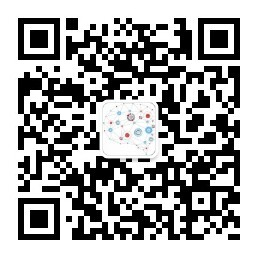
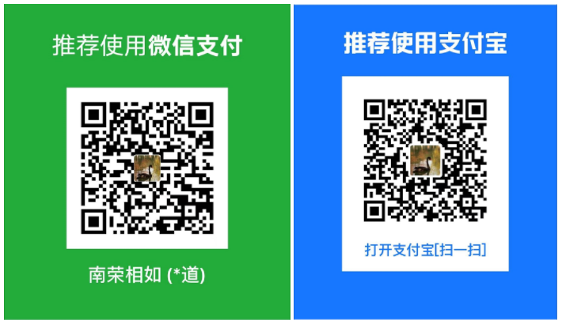

编程是艺术：编程是现代世界的魔法，是将抽象的想法转化为现实的工具。

AI是未来：人工智能是我们时代最令人着迷的领域之一，它为我们带来了无数的机会和挑战。

文字是力量：写作是表达思想和感情的艺术，是传播知识和启发他人的媒介。

旅行是奇迹：旅行是探索世界和拓展视野的绝佳方式。

## 写作

- [ASP.NET Core+Vue.js全栈开发训练营](./_posts/2024-01-01-post01.md)

<!-- ## 编程 -->

<!-- - [Molong:基于.NET+Vue的博客系统](./_posts/2024-01-01-post01.md) -->
<!-- - [ChangLi:基于.NET+Vue的ERP系统](./_posts/2024-01-01-post01.md) -->
<!-- - [LingGui:基于.NET+Vue的通用权限系统](./_posts/2024-01-01-post01.md) -->

## 自媒体

- [知乎](https://www.zhihu.com/people/zcqiand/)

## 联系我

- 微信公众号：南荣相如
- 邮箱：1282301776@qq.com
- Github: https://github.com/zcqiand

## 微信公众号

如果大家想要实时关注我更新的文章以及分享的干货的话，可以关注我的公众号。

## 捐赠支持

如果觉得我们的内容对于你有所帮助，请作者喝杯咖啡吧！ 后续会继续完善更新！一起加油！

